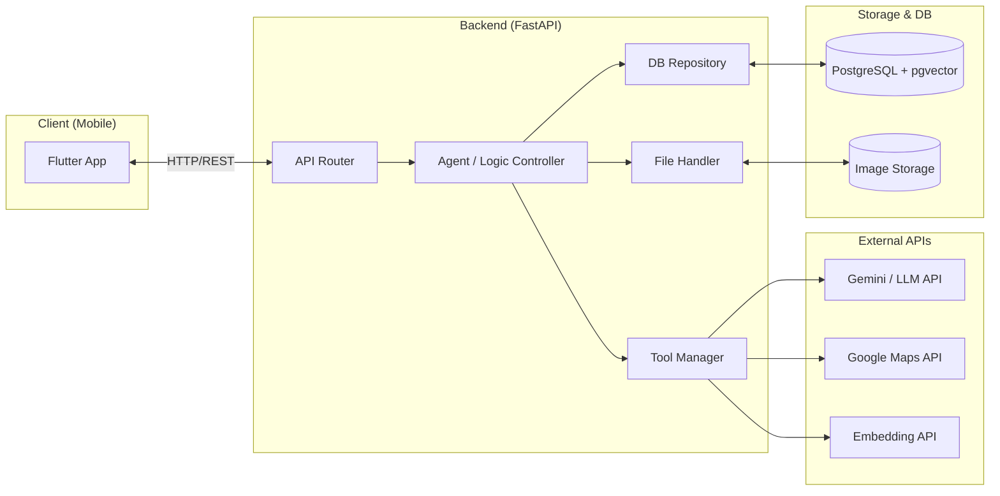

```mermaid
graph LR
    subgraph "Client (Mobile)"
        A[Flutter App]
    end

    subgraph "Backend (FastAPI)"
        B[API Router]
        C[Agent / Logic Controller]
        D[Tool Manager]
        G[DB Repository]
        H[File Handler]
    end

    subgraph "External APIs"
        E1[Gemini / LLM API]
        E2[Google Maps API]
        E3[Embedding API]
    end

    subgraph "Storage & DB"
        F1[(PostgreSQL + pgvector)]
        F2[(Image Storage)]
    end

    A <-->|HTTP/REST| B

    B --> C
    C --> D
    C --> G
    C --> H

    D --> E1
    D --> E2
    D --> E3

    G <--> F1
    H <--> F2
```