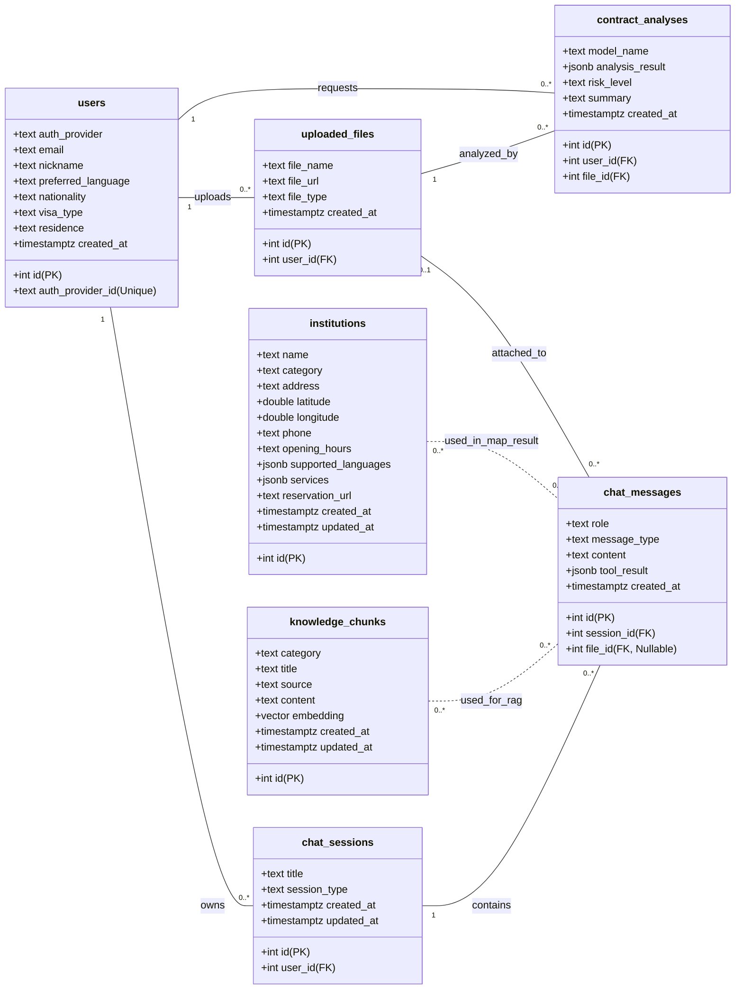

# 데이터베이스 설계도

```mermaid
classDiagram
    direction LR

    class users {
        +int id (PK)
        +text auth_provider
        +text auth_provider_id (Unique)
        +text email
        +text nickname
        +text preferred_language
        +text nationality
        +text visa_type
        +text residence
        +timestamptz created_at
    }

    class chat_sessions {
        +int id (PK)
        +int user_id (FK)
        +text title
        +text session_type
        +timestamptz created_at
        +timestamptz updated_at
    }

    class chat_messages {
        +int id (PK)
        +int session_id (FK)
        +text role
        +text message_type
        +text content
        +int file_id (FK, Nullable)
        +jsonb tool_result
        +timestamptz created_at
    }

    class uploaded_files {
        +int id (PK)
        +int user_id (FK)
        +text file_name
        +text file_url
        +text file_type
        +timestamptz created_at
    }

    class contract_analyses {
        +int id (PK)
        +int user_id (FK)
        +int file_id (FK)
        +text model_name
        +jsonb analysis_result
        +text risk_level
        +text summary
        +timestamptz created_at
    }

    class institutions {
        +int id (PK)
        +text name
        +text category
        +text address
        +double latitude
        +double longitude
        +text phone
        +text opening_hours
        +jsonb supported_languages
        +jsonb services
        +text reservation_url
        +timestamptz created_at
        +timestamptz updated_at
    }

    class knowledge_chunks {
        +int id (PK)
        +text category
        +text title
        +text source
        +text content
        +vector embedding
        +timestamptz created_at
        +timestamptz updated_at
    }

    %% 사용자 관계
    users "1" -- "0..*" chat_sessions : owns
    users "1" -- "0..*" uploaded_files : uploads
    users "1" -- "0..*" contract_analyses : requests

    %% 채팅 관계
    chat_sessions "1" -- "0..*" chat_messages : contains

    %% 파일 첨부 관계
    uploaded_files "0..1" -- "0..*" chat_messages : attached_to

    %% 계약서 분석 관계
    uploaded_files "1" -- "0..*" contract_analyses : analyzed_by

    %% 독립 테이블
    institutions "0..*" .. "0..*" chat_messages : used_in_map_result
    knowledge_chunks "0..*" .. "0..*" chat_messages : used_for_rag
```