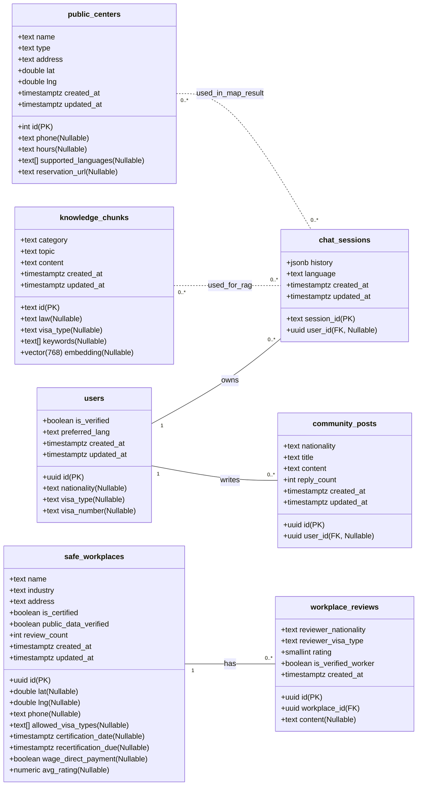

# 데이터베이스 설계도

```mermaid
classDiagram
    direction LR

    class knowledge_chunks {
        +text id (PK)
        +text category
        +text topic
        +text law (Nullable)
        +text visa_type (Nullable)
        +text content
        +text[] keywords (Nullable)
        +vector(768) embedding (Nullable)
        +timestamptz created_at
        +timestamptz updated_at
    }

    class public_centers {
        +int id (PK)
        +text name
        +text type
        +text address
        +double lat
        +double lng
        +text phone (Nullable)
        +text hours (Nullable)
        +text[] supported_languages (Nullable)
        +text reservation_url (Nullable)
        +timestamptz created_at
        +timestamptz updated_at
    }

    class users {
        +uuid id (PK)
        +text nationality (Nullable)
        +text visa_type (Nullable)
        +text visa_number (Nullable)
        +boolean is_verified
        +text preferred_lang
        +timestamptz created_at
        +timestamptz updated_at
    }

    class chat_sessions {
        +text session_id (PK)
        +uuid user_id (FK, Nullable)
        +jsonb history
        +text language
        +timestamptz created_at
        +timestamptz updated_at
    }

    class safe_workplaces {
        +uuid id (PK)
        +text name
        +text industry
        +text address
        +double lat (Nullable)
        +double lng (Nullable)
        +text phone (Nullable)
        +text[] allowed_visa_types (Nullable)
        +boolean is_certified
        +timestamptz certification_date (Nullable)
        +timestamptz recertification_due (Nullable)
        +boolean public_data_verified
        +boolean wage_direct_payment (Nullable)
        +int review_count
        +numeric avg_rating (Nullable)
        +timestamptz created_at
        +timestamptz updated_at
    }

    class workplace_reviews {
        +uuid id (PK)
        +uuid workplace_id (FK)
        +text reviewer_nationality
        +text reviewer_visa_type
        +smallint rating
        +text content (Nullable)
        +boolean is_verified_worker
        +timestamptz created_at
    }

    class community_posts {
        +uuid id (PK)
        +uuid user_id (FK, Nullable)
        +text nationality
        +text title
        +text content
        +int reply_count
        +timestamptz created_at
        +timestamptz updated_at
    }

    %% 사용자 관계
    users "1" -- "0..*" chat_sessions : owns
    users "1" -- "0..*" community_posts : writes

    %% 안심 사업장 관계
    safe_workplaces "1" -- "0..*" workplace_reviews : has

    %% 에이전트 논리적 참조
    knowledge_chunks "0..*" .. "0..*" chat_sessions : used_for_rag
    public_centers "0..*" .. "0..*" chat_sessions : used_in_map_result
```
